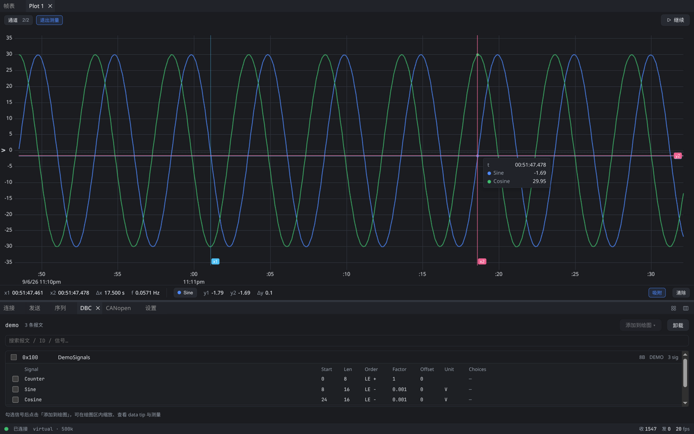
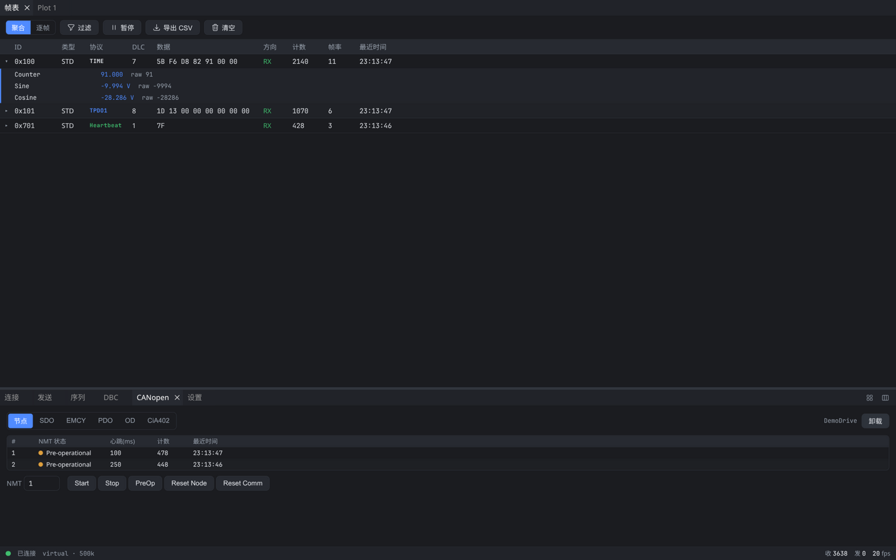
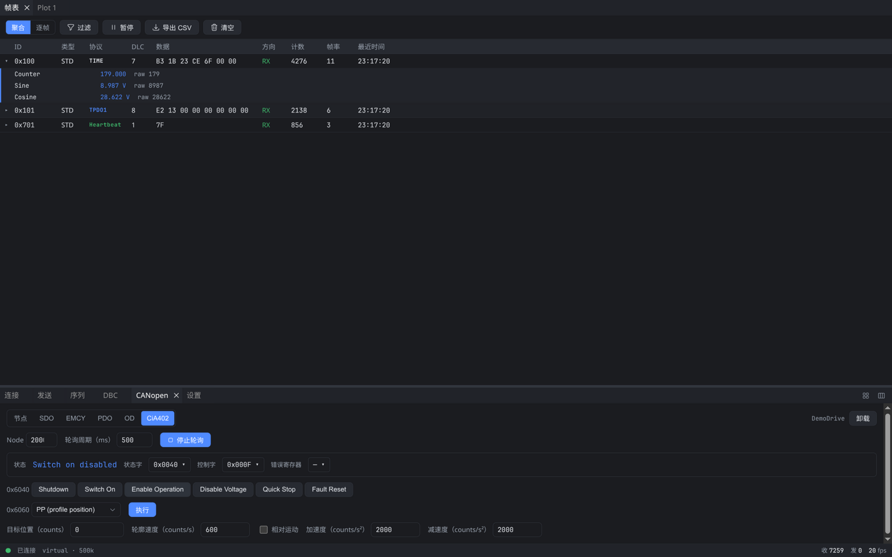
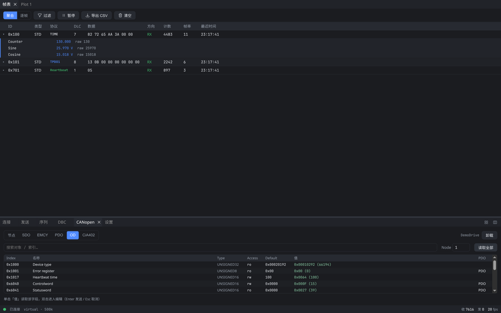
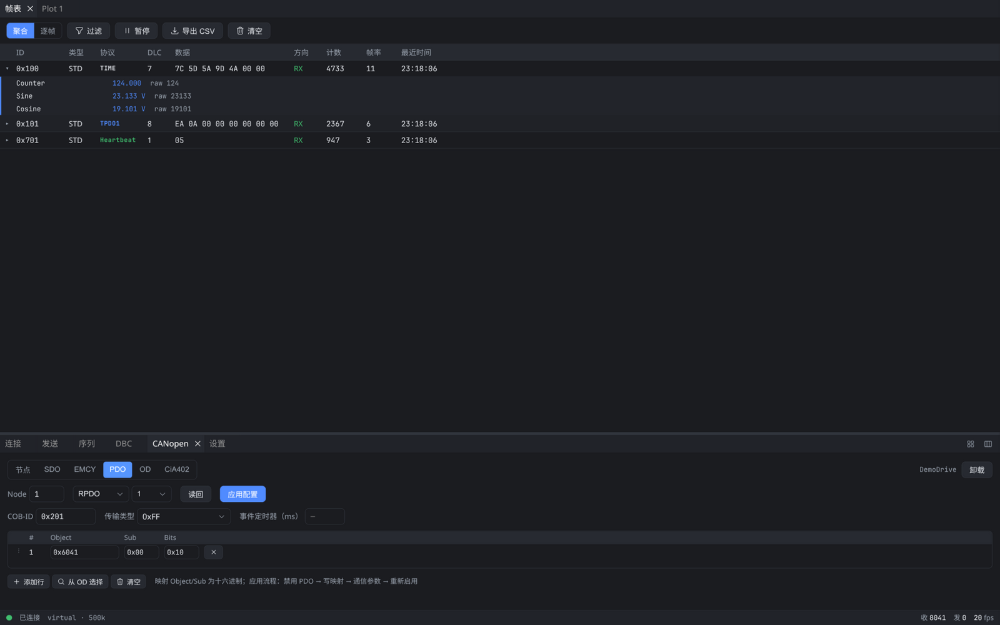
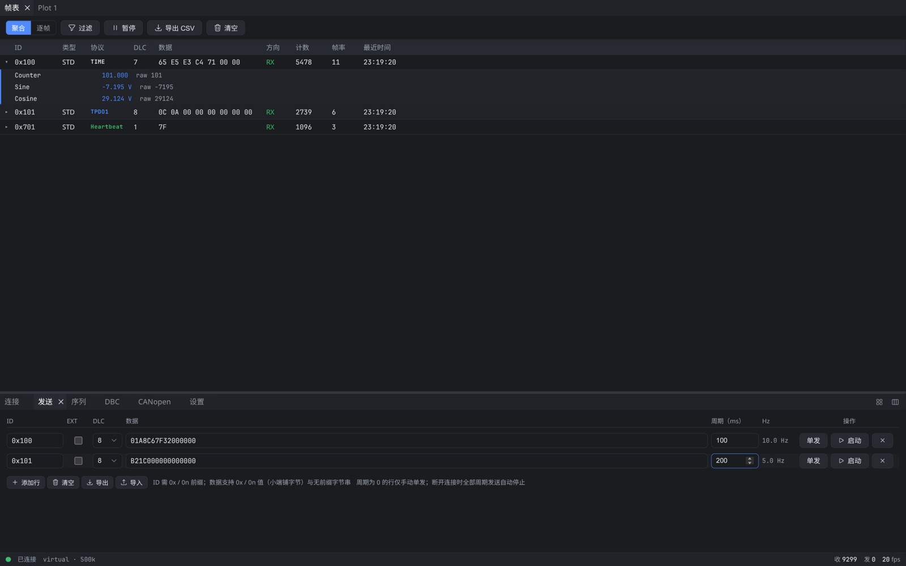
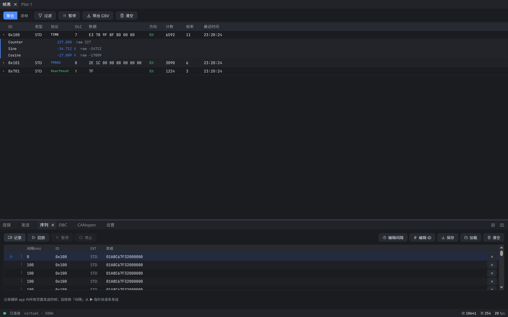
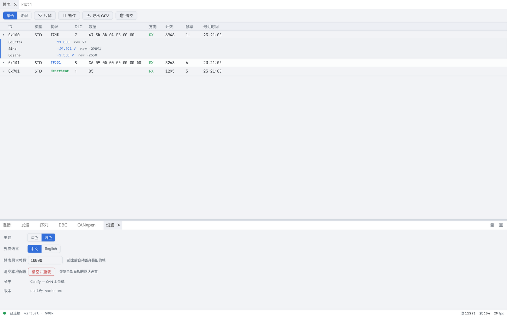

<div align="center">


# Canify

**A modern, lightweight CAN / CANopen analyzer**

[中文](README.md) | [English](README.en.md)

[](https://github.com/vaxowt/canify/releases/latest)
[](https://github.com/vaxowt/canify/releases/latest)
[](https://github.com/vaxowt/canify/releases/latest)
[](LICENSE)
[](https://vaxowt.github.io/canify/)

</div>

---

Canify is a desktop CAN bus analyzer: plug in a $15 SLCAN adapter and you get live bus monitoring, DBC signal decoding, real-time plotting, frame transmission, and full CANopen node debugging. One-click install — no runtime dependencies, and all data stays on your machine.


## ✨ Features

### Connection & Frame Table

- **SLCAN serial driver**: works with CANable (SLCAN firmware), MKS CANable, cantact, Arduino CAN shields, and other affordable adapters; bitrates from 10 kbps to 1 Mbps. A built-in **virtual bus** (loopback) lets you try everything without hardware
- **Aggregate / trace frame table**: per-ID aggregation (count, frame rate, last seen, new-frame highlight) or frame-by-frame trace mode; virtual scrolling stays smooth under heavy bus load
- **Live filtering**: hex ID lists / ranges and data-byte conditions, combined with AND / OR
- **One-click CSV export**, pause / resume, configurable frame buffer limit

### Transmit & Sequence

- **Multi-frame send list**: per-row ID / extended flag / DLC / data / period; send once or periodically; all periodic sends stop automatically on disconnect
- **Sequence record & replay**: record **every** frame sent by the app (including SDO / NMT operations from the CANopen panel), then replay it with the original frame timing; draggable replay pointer, bulk delta / ID editing, save / load sequence files

### DBC & Live Plotting

- **DBC signal decoding**: import a `.dbc` and expand physical signal values right inside the frame table (units and choice tables included)
- **Signal plotting**: tick DBC signals to plot them — up to 8 curves per plot with multiple plot panels; LTTB downsampling and rate-limited rendering keep it smooth even on busy buses
- **Crosshair measurement**: drag to zoom, double-click to resume scrolling; in measure mode two crosshairs read out values with Δt / Δv, optionally snapped to curve samples

### CANopen, All in One Place

- **Passive decoding**: node table (NMT state, heartbeat interval), SDO transaction log (request / response auto-pairing with ABORT code explanations), EMCY decoding
- **Active operations**: SDO read / write (including segmented transfer), NMT master control (Start / Stop / PreOp / Reset)
- **EDS object dictionary**: import an `.eds`, browse the dictionary, read / write single objects, or read all standard objects at once
- **PDO configuration editor**: visually edit RPDO / TPDO mappings and communication parameters; one-click apply following the standard procedure (disable → write mapping → write comm params → re-enable), with read-back
- **CiA 402 drive control**: state machine visualization (bit-level statusword / controlword decoding), quick commands (Shutdown, Switch On, Enable Operation, …), PP / PV operation modes with motion parameters, and a first-use safety confirmation before enabling

### Interface & Experience

- **Dockable layout**: freely split and rearrange both the display area and the control dock; layouts are remembered
- **Dark / light theme**, **中文 / English UI**, one click away
- **Lightweight native app**: built with Tauri 2 + Rust — small installers, fast startup, no runtime dependencies

## 📦 Download

Grab the installer for your platform from [**Releases**](https://github.com/vaxowt/canify/releases/latest):

| Platform | File | Notes |
|---|---|---|
| Windows 10/11 x64 | `canify_<version>_x64-setup.exe` | Installer |
| Windows 10/11 x64 | `canify_<version>_windows-x64-portable.zip` | Portable, no install |
| Debian / Ubuntu | `canify_<version>_amd64.deb` | `sudo dpkg -i canify_*.deb` |
| Fedora / RHEL | `canify-<version>-1.x86_64.rpm` | `sudo rpm -i canify-*.rpm` |
| Any Linux | `canify_<version>_amd64.AppImage` | Runs directly, no FUSE2 required |
| Any Linux | `canify_<version>_linux-x64-portable.zip` | Portable; requires system WebKitGTK |

> The Windows build relies on the WebView2 runtime (bundled with Windows 10/11 by default); if missing, the installer will guide you through an online install.
>
> Versions are derived automatically from git tags of the source repository (e.g. `0.2.0`); see Settings → About for the current version.

## 🚀 Quick Start

1. **Connect**: in the Connection panel pick `SLCAN (serial)`, select the serial port and bitrate (e.g. 500 kbps), and click Connect. No hardware? Choose the `Virtual Bus` to explore every feature.
2. **Import a DBC**: load a `.dbc` in the DBC panel, expand decoded signals in the frame table, tick signals and click "Add to plot" to start live plotting.
3. **Debug CANopen**: watch nodes and the SDO log in the CANopen panel; import an `.eds` to browse the object dictionary, configure PDOs, and control a CiA 402 drive.

> **Linux serial permissions**: add yourself to the `dialout` group (Debian/Ubuntu) or `uucp` group (Arch), then log out and back in:
>
> ```bash
> sudo usermod -aG dialout $USER   # Debian / Ubuntu
> sudo usermod -aG uucp $USER      # Arch
> ```

## 🔌 Supported Hardware

| Adapter | Interface | Notes |
|---|---|---|
| CANable / MKS CANable / cantact (SLCAN firmware) | Serial | Recommended — ~$15 |
| Arduino + CAN shield (SLCAN firmware) | Serial | MCP2515 / MCP2518 based |
| Any serial device speaking the slcan protocol | Serial | Linux `/dev/ttyUSB*`, Windows COM ports |
| Virtual bus | Built-in | Loopback mode, for development and demos |

> SocketCAN (Linux `can0`) is on the roadmap — see [Roadmap](#-roadmap).

## 🖼 More Screenshots

<details>
<summary><b>Click to expand</b></summary>

| | |
|---|---|
|  |  |
| **Live plotting & measurement** | **CANopen node monitoring** |
|  |  |
| **CiA 402 drive control** | **Object dictionary browser** |
|  |  |
| **PDO configuration editor** | **Multi-frame transmit** |
|  |  |
| **Sequence record & replay** | **Light theme** |

</details>

## 🗺 Roadmap

- [ ] SocketCAN driver (native Linux `can0`)
- [ ] CAN FD (the frame model already reserves payload length)
- [ ] More log formats (Vector .asc, PCAP, candump)
- [ ] Multi-channel connections
- [ ] macOS build

## ❓ FAQ

**Is Canify free?**
Yes — free to use, no registration, no feature limits.

**Does it support CAN FD?**
Not yet; CAN FD is on the roadmap. The current frame data model already reserves payload length for FD.

**Is there a macOS build?**
Not yet — it is on the roadmap.

**Is any data uploaded?**
No. Canify runs entirely locally: no cloud, no telemetry, no outbound requests.

**Linux says "permission denied" when opening the serial port?**
See the serial permission note in [Quick Start](#-quick-start).

**Is it open source?**
Canify is freeware but closed source, distributed as binary installers. Feedback and feature requests are welcome via [Issues](https://github.com/vaxowt/canify/issues).

## 🔒 Privacy & Security

Canify contains no data collection, crash reporting, or analytics. Apart from files you explicitly save or export, it makes no network or external connections. All bus data lives only in your machine's memory.

## 📄 License

Canify is proprietary freeware; see [LICENSE](LICENSE) for terms of use and redistribution.

Canify is built on top of many excellent open-source projects — thank you:

[Tauri](https://tauri.app/) · [Vue 3](https://vuejs.org/) · [Pinia](https://pinia.vuejs.org/) · [uPlot](https://github.com/leeoniya/uPlot) · [dockview](https://dockview.dev/) · [can-dbc](https://github.com/oxibus/can-dbc) · [serialport-rs](https://github.com/serialport/serialport-rs)
